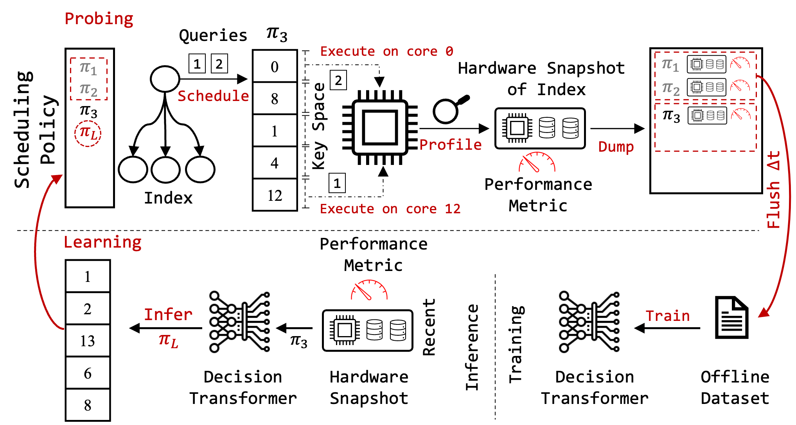
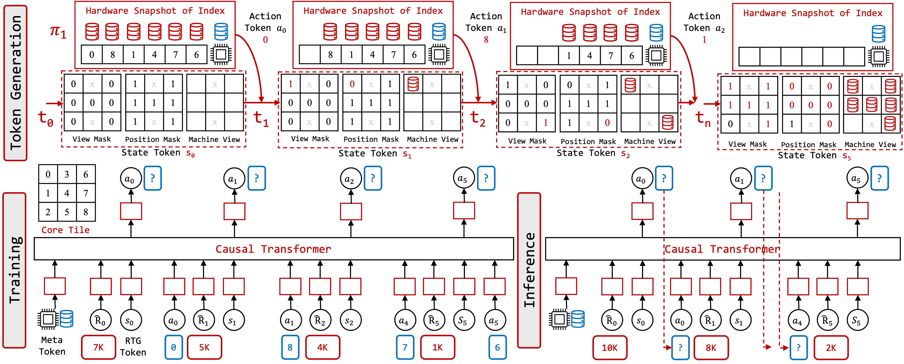

# P-MOSS: Learned Scheduling For Indexes Over NUMA Servers Using Low-Level Hardware Statistic

P-MOSS is a learned Performance MOnitoring Unit (PMU) driven Spatial Query Scheduling framework, that utilizes spatial query scheduling to improve the query execution performance of main memory indexes in NUMA servers. There are 2 component to PMOSS: a system component and a learned component. This repo contains the code for the learned component of PMOSS.


Architecture Overview
--------------------------------------------------------------------------------



Learned Component of PMOSS
--------------------------------------------------------------------------------


Running L-PMOSS
--------------------------------------------------------------------------------
### Requirements
```
pip install -r requirements.txt
```

### Training 

```
python run_dt_place.py --p "intel_skx_4s_8n" --mpath "None" --wl 12 --ecfg 100 --sidx 259 --rtg 2

```
### Inference
```
python run_dt_place.py --p "intel_skx_4s_8n" --mpath "save_models/intel_skx_4s_8n/0/2024-10-25-18-14-13-0.992.pkl" --wl 12 --ecfg 100 --sidx 259 --is_eval_only --rtg 2
```


